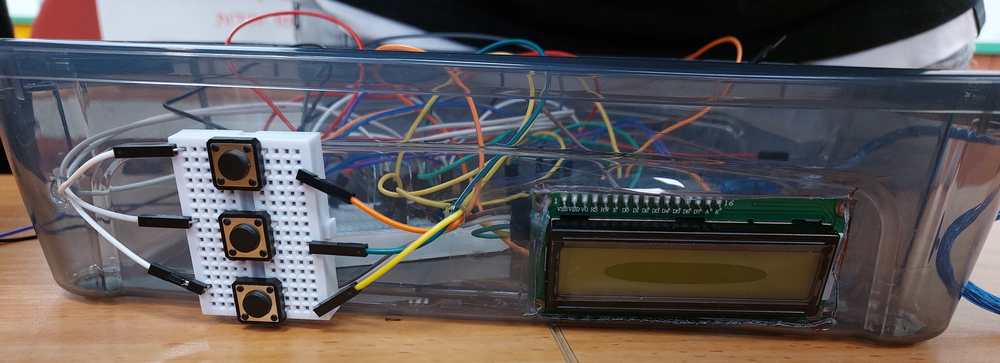

# Automatic_Pet_Feeder
------------------

- The project is a practical project, a combination of connecting sensors and motors to an Arduino board, writing code and connecting all the components together to create a robot.

- Open the code in arduino IDE (you can download it [here](https://www.arduino.cc/en/software))

## The final result:
- You can watch the video with the pet [here](https://drive.google.com/file/d/1izn00LDfmfZ7mllzdkYeRc1p3D09ykgU/view?usp=sharing) -> Google Drive).
- You can watch the video in the lab [here](https://drive.google.com/file/d/1SpbiHcdAeh8mPDBuBdDKa1x7ciby_aiF/view?usp=sharing) -> Google Drive).

## The Pictures:
- The connections:

- The lcd and buttons:

- The robot:

## The connection simulation:

## The Algorithm - Flowchart:

Note: You can open the "Pet Feeder Project.docx" to see more details about this project.

------------------

------------------

